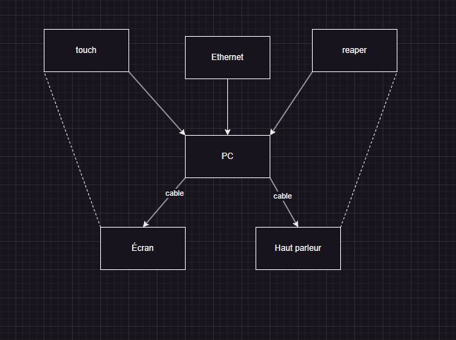
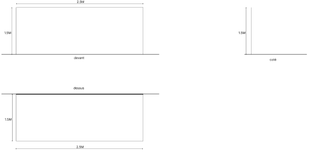
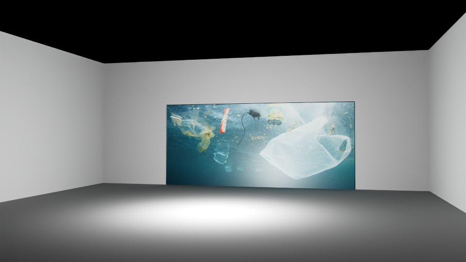
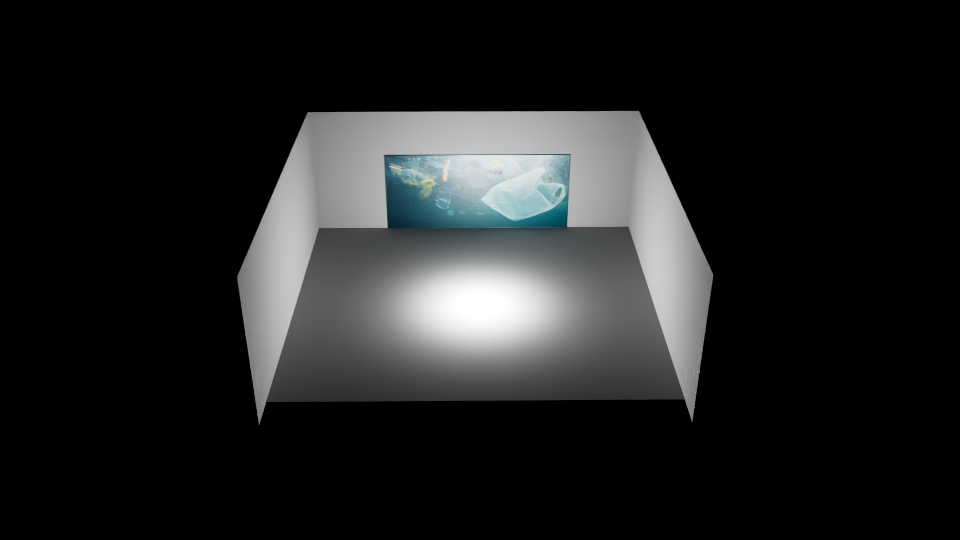
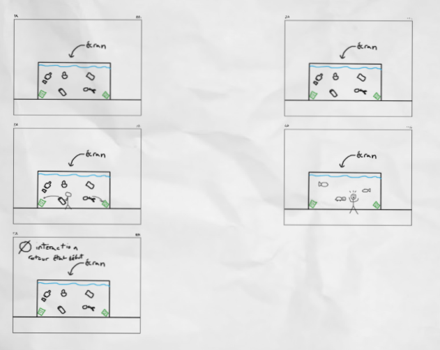

### Synoptique
Installation Interactive
  * Éléments :
    - Écran (ou projecteur)
    - Haut parleur
  * Mécanique de Jeu :
    - Interaction : Déplacer les déchets vers des poubelles en les draggants sur l'écran.
    - Moins il y a de déchets, plus l'environnement se nettoie.
    - Lorsque le jeu n'est pas joué, des déchets s'accumulent à l'écran.

### Plantation

### Simulation

### Scénarimage

### Devis Technique
 * équipement :
   - 1 x Système audio (Haut parleur)
   - 1 x Mac ou PC configuré pour la présentation
   - 1 x Écran tactile (ou projecteur)
   - 1 x Câble HDMI et autres câbles
   - 1 x Câble Ethernet
   - 1 x Logiciel d’interaction (touch designer, reaper)
